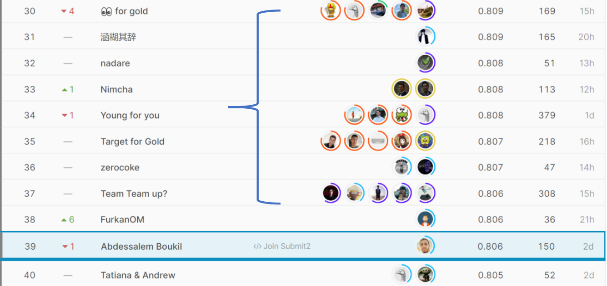
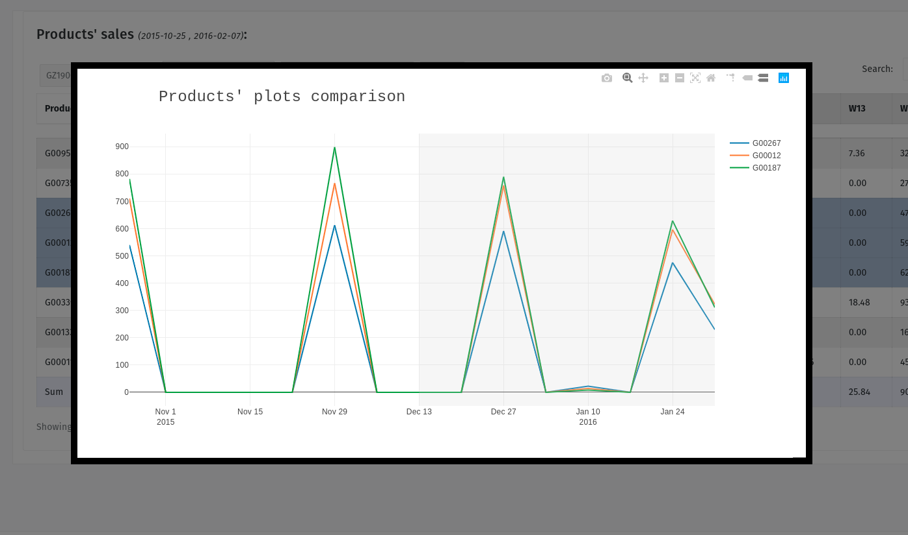
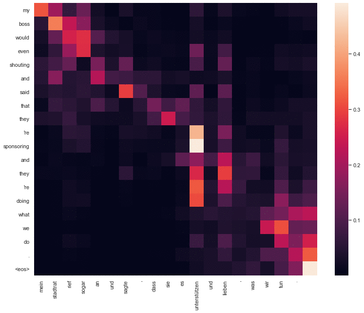

## maroxtn.github.io

# Abdessalem Boukil Data Science Portfolio
This is a list of work that I have done in the field of data science and deep learning. It includes competitions that I've participated in, personal projects, guides and notebooks. This list will updated constantly.

## **Solo silver medal (2%) in a kaggle competition**
I was ranked the 39th out of 3345 competitor (2%) that won me a silver medal. The competition is a featured competition targeting the knowledge tracing problem, i.e. estimating if a student would answer a question right or wrong based on their history. For my solution, I used an ensemble of an LGBM and SAINT transformer model, which you can find their respective sources, [here](https://github.com/maroxtn/LGBM-riiid-kaggle) and [here](https://github.com/maroxtn/SAINT-Transformer-riiid-kaggle).

## **#1st Place Zindi competition**

Ranked the 1st in Zindi Tunisian Arabizi sentiment analysis competition from the bulk of 752 other competitors. Arabizi is Arabic that is written in latin letters and numbers, for example:

- "قداه الوقت" becomes: <i>"9adeh lwa9t"</i> ?
- "خليه يتعدا" becomes: <i>"5alih yet3adda"</i> ? ...

One problem with Arabizi that it has no definite spellings of words, spelling of the same word can vary from a person to the other, and many words can be ambiguous, depending on their context. For that reason, I manually annotated a dataset containing 17k transliterated word (there are duplicate words with different spellings), and used it to train a transformer to transliterate the competition dataset to Arabic. I later used that transliterated text to finetune a huggingface Arabic dialect bert model (`moha/arabert_c19`: [https://arxiv.org/abs/2105.03143](https://arxiv.org/abs/2105.03143)).

I collected this dataset by scraping 30k Arabizi facebook comments, extracting the most common words and then annotating them manually with their Arabic counter part. 

The dataset and the code is freely available on the *github repo* [https://github.com/maroxtn/tun-sentiment](https://github.com/maroxtn/tun-sentiment). I invite you to read the code, it is fully modular and carefully documented.

Here also I created a *colab notebook* in which you can test the sentiment analysis model with your own personal Tunisian Arabizi sentences (unless you are not Tunisian of course): [https://colab.research.google.com/drive/1kTdHap1RmGdyTnDqAyfExJEguzMuCXh9](https://colab.research.google.com/drive/1kTdHap1RmGdyTnDqAyfExJEguzMuCXh9).

## **Predictive sales dashboard**
I created and deployed an LSTM deep learning model in a real-time dashboard that computes sales prediction for a list of +160 products. This was during the course of an internship as a data scientist. I used Tensorflow to train the model, and Flask to deploy it. All the code is available [here](https://github.com/maroxtn/forecast-dashboard).

In order to get the utmost accuracy, I used Scikit Optimize to optimize the hyperparameters of the model. It uses Bayesian meta-Optimization, which is not a gradient based optimization. Training this meta-optimizer took around a day and a half. It approximated the best possible hyperparameters for my model. This took place as my graduation project in order for me to obtain my computer science diploma.

## **Attention types comparison**
The goal behind this project was to compare between [RNN using Bahdanau attention](https://arxiv.org/abs/1409.0473) translation, and Transformer translation, in terms of attention weights and translation quality. Both models had only one layer, similar in network size, training data, and number of epochs. The code is available [here](https://github.com/maroxtn/Transformer-vs-bahdanau-attention). The code is fully reproducible.

Needless to say that the Transformer performed slighly better than the RNN model, but it could've performer even better if it wasn't for the limitation in its hyperparameters (1 layer, 1 attention head).

The hyperparameters were constrained so a proper comparision in attention weights would be possible. It would be hard for example to see the difference between the attention weights of the two models if the Transformer had more than one attention head, or if it had more than one layer.
&nbsp;

The difference between transformer translation (first) attention weights, and Bahdanau attention translation (second).

## **SAINT Transformer guide notebook**
After the Riiid competition ended, I wrote a notebook that extensively explains my implementation of the model, and my way of performing inference. You can find it [here](https://www.kaggle.com/abdessalemboukil/saint-training-inference-guide-39th-solution/comments).

I got a bronze medal on this notebook as it provided a comprehensive guide for future googlers who want a solid starter notebook with a decent solution.
## **Scraped and trained a text generation model in Tunisian Arabic**
I scraped tweets, Facebook comments and articles in Tunisian Arabic, that I used to train a text generation LSTM cell, which outputed interesting results. 

This project was a good opportunity for me to implement beam search and experiment with different hyper-parameters and see what they output. The problem however was that in order to get decent results, I need a really big dataset.

## **Trump Speech Generator**
I used the huggingface Transformers library to immitate Trump's style of speech. To do that, I fine tuned GPT2 model on the bulk of 30 Trump's rally speeches. I used different text generation techniques to generate the text. This project was a good opportunity to test the huggingface library, and to experience the ease of their abstraction.

**Seed**: Obama is

**Generated text**: Obama is the craziest person I've ever met." I said, "You mean like him when he's on this show? I haven't seen him in over 25 years because of all the crazy stuff. He's crazy." But we have them all because he has such a big following. If I didn't have that massive following for a candidate, or for other things too, I would have not done so well. When I did, it was all done for political. And then I think we...

*Source code*: [https://github.com/maroxtn/trump_speech_generator](https://github.com/maroxtn/trump_speech_generator)

*Try it yourself in Colab*: [https://colab.research.google.com/drive/12hw55uGm80ikiq9wLtZ2GsWpRnGUCdXv?usp=sharing](https://colab.research.google.com/drive/12hw55uGm80ikiq9wLtZ2GsWpRnGUCdXv?usp=sharing)

## **Simple EDA and Visualization of gym attendance**

This is a simple project I have done. It's an exploratory data analysis of a gym attendance dataset, and it's schedule. In this body of work, I analysed the frequency of clients based on hours / type of work, and gave my suggestions for a better schedule.

I also visualized data using matplotlib library and seaborn. The dataset is a small dataset (2730, 1806 recorded class + 924 live class attendance). 

*Take a look at the notebook* [https://nbviewer.jupyter.org/github/maroxtn/gym-schedule-eda/blob/main/EDA%20notebook.ipynb](https://nbviewer.jupyter.org/github/maroxtn/gym-schedule-eda/blob/main/EDA%20notebook.ipynb) 

*The github repo here*: [https://git.io/JtdVZ](https://git.io/JtdVZ).